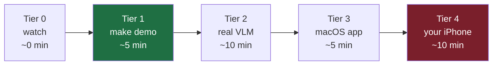

# Judging Nightjar — a 5-tier validation ladder

You can validate Nightjar at whatever depth you have time for. Each tier is
self-contained; **Tier 1 needs no iPhone and no model** and runs in ~5 minutes.



| Tier | You do | You get | Needs |
|---|---|---|---|
| **0** | nothing | video + `report.md` + screenshots stand alone | — |
| **1** | `git clone && make demo` | full pipeline on a synthetic clip → alert + telemetry report, on your machine | C++17 + CMake |
| **2** | build with `-DNIGHTJAR_VLM=ON`, run `nightjar_flow` | English rule → compiled → **real SmolVLM** guards a clip → alert | + llama.cpp (brew) + models |
| **3** | open the macOS shell | same engine, your Mac's camera, GUI | Xcode |
| **4** | Xcode + your iPhone | the full on-device experience | cable + Apple ID (free) |

---

## Tier 1 — the honest 5-minute check (no iPhone, no model)

```bash
git clone https://github.com/hungtruongOwolf/nightjar && cd nightjar
make test    # 23 suites: scalar-vs-NEON parity, temporal logic, compiler, codec ...
make demo    # synthetic "person lingers" clip → LOITERING alert + per-stage report
make bench   # gate micro-benchmark: per-step scalar vs NEON, µs/frame
```

`make demo` prints the fired alert (with the rule's English + a temporal fact
like `[present 2s]`), frame delivered/dropped counts, and a `report.md`-style
table with per-stage p50/p90/p99 (VLM split encode/prefill/decode) and counters.
Everything is deterministic and reproducible — no network, no model.

**Why the numbers are honest:** the replay pump delivers frames on the clip's
wall-clock schedule and never waits for the system. When the VLM is busy,
conflation drops rise and the next event's latency is counted in full
(anti-coordinated-omission).

## Tier 2 — real inference

```bash
brew install llama.cpp                       # + ggml
cmake -S engine -B engine/build -DNIGHTJAR_VLM=ON && cmake --build engine/build
# download SmolVLM-500M (recipes/model.md) + Qwen2.5-1.5B for the compiler, then:
engine/build/nightjar_flow  qwen2.5-1.5b-instruct-q4_k_m.gguf  \
   SmolVLM-500M-Instruct-Q4_0.gguf  mmproj-SmolVLM-500M-Instruct-f16.gguf  \
   <frames_dir>  "notify me if a person enters the backyard after 10pm"
```

Compiles the English rule with Qwen (freed after setup), then guards the clip
with SmolVLM. `engine/build/compile_eval` reproduces the 12/12 compiler
accuracy; `engine/build/kv_reuse_bench` reproduces the 2.6× KV-reuse win.

## Tiers 3–4 — on device (known frictions, written down)

- **macOS Gatekeeper** (unnotarized, no \$99 account): first open is blocked →
  System Settings → Privacy & Security → **Open Anyway**. Or:
  `xattr -d com.apple.quarantine Nightjar.app`.
- **iOS Developer Mode** (iOS 16+): Settings → Privacy & Security → Developer
  Mode → on → restart.
- **Free provisioning**: set a **Personal Team** (any Apple ID) in Signing &
  Capabilities; change the bundle identifier if it clashes. Signatures expire
  after 7 days — rebuild from Xcode weekly.

---

## What to look for (the claims, and where to check them)

| Claim | Reproduce with |
|---|---|
| NEON gate 58 µs/frame; scalar == NEON | `make bench` · `make test` (parity suites) |
| VLM 2.6× via KV-reuse, identical answers | `kv_reuse_bench` (Tier 2) |
| Fast path stays µs under a saturated VLM | `engine/build/nightjar_concurrency_bench` |
| 88 % of VLM compute gated away | `engine/build/nightjar_ablation` |
| English → correct temporal rule (12/12) | `compile_eval` (Tier 2) |
| Clip storage 11.7× (JPEG) + 2.5× (inter-frame) | `make test` (clip encoder / codec suites) |

Every published number carries `[VERIFIED: device, model, commit]` or is marked
`[TBD]` (iPhone figures pending a data cable). Numbers without a tag are bugs.
