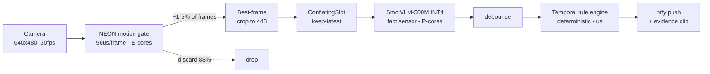
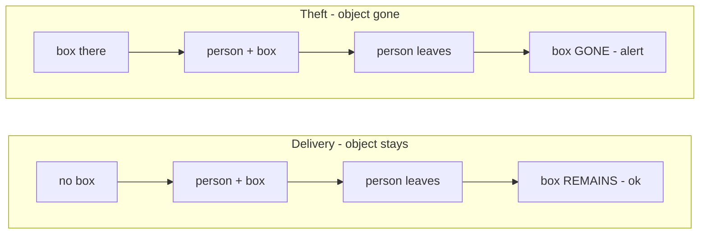
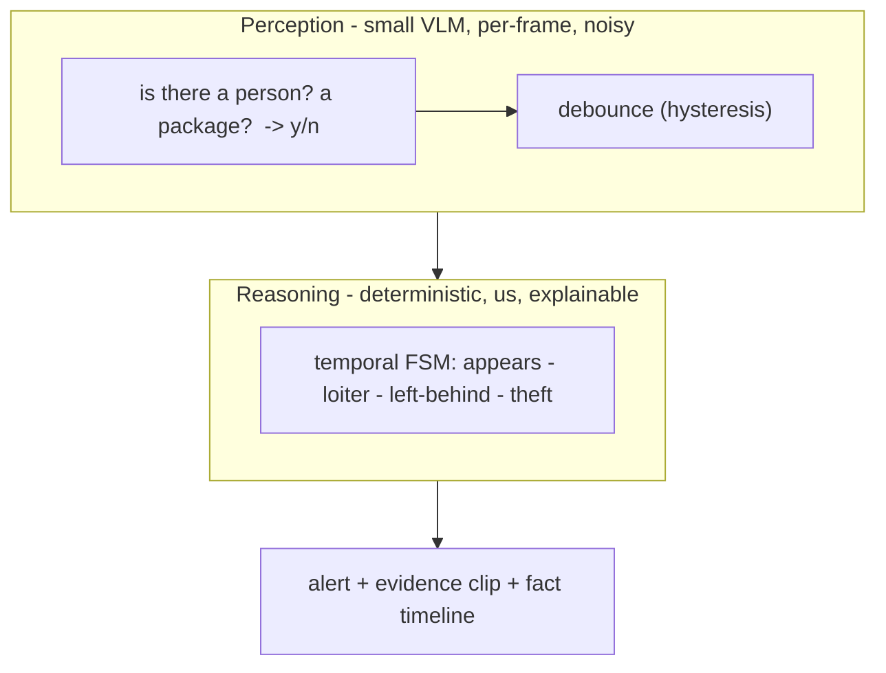
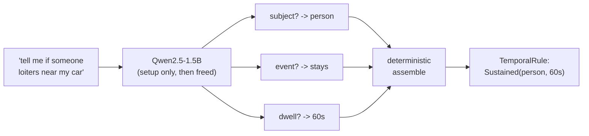
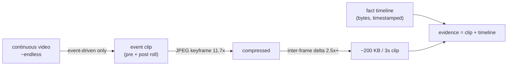

# Nightjar

*Sits still. Watches all night. Never phones home.*

**Turn the spare phone in your drawer into a guard you program in one plain-English sentence — 100% on-device.**

> Type *"tell me if someone loiters near my car after 10pm."* Nightjar compiles that once, on the phone, into a deterministic rule, then watches: a hand-written NEON motion gate (56 µs/frame) feeds an INT4 vision-language model only the ~1–5 % of frames that matter. No cloud. No account. No subscription. Airplane mode and it still works.

Built for the **Arm Create: AI Optimization Challenge 2026 — Track 3 (Mobile AI, "camera intelligence")**. All inference runs locally on Arm64 via llama.cpp + KleidiAI.

<p align="center">
  
  &nbsp;&nbsp;
  
</p>
<p align="center"><sub>Left: the flow — describe a rule in English → confirm → mark a zone → guard. Right: the live guard (Mac webcam / iOS) — the gate tracks motion and the alert fires.</sub></p>

## ▶︎ Try it — judges start here (5 minutes · no iPhone · no model)

```sh
git clone https://github.com/hungtruongOwolf/nightjar && cd nightjar
make test    # 23/23 unit tests — NEON==scalar parity, temporal engine, clip codec
make demo    # full pipeline on a synthetic clip → alerts + a self-generated report
```

- **Live camera demo (Mac webcam):** `cd shells/ios && xcodegen && xcodebuild -scheme NightjarMac -configuration Release build`, open the built `NightjarMac.app`, allow the camera.
- **Real SmolVLM + KleidiAI numbers, full validation ladder:** **[JUDGES.md](JUDGES.md)**.
- **Sample `make demo` output:** **[report.md](report.md)**. · **Everything that's done + submission notes:** **[SUBMISSION.md](SUBMISSION.md)**.



---

## Why this exists — not a smarter camera, *programmable perception*

A Ring or Nest only says *"motion detected."* Making a camera alert on **what you actually care about** normally needs an ML engineer, training data, and a cloud GPU. Nightjar collapses that to **one sentence, on hardware you already own.**

> **The spreadsheet moment for computer vision:** spreadsheets let anyone program logic without being a programmer. Nightjar lets anyone program a camera without being an ML engineer.

| Vision pillar | What it changes |
|---|---|
| **Democratized vision** | Program a camera in plain English — no ML, no cloud, no code |
| **Wakes billions of idle Arm devices** | Every old phone is a supercomputer with a camera + NPU + battery. Reactivate it. |
| **Privacy over surveillance-capitalism** | Images never leave the device. No account, no subscription, works offline. |
| **Beyond security** | *"tell me if grandma hasn't moved in 2 hours"* - *"if the baby climbs out of the crib"* - *"when the delivery arrives"* — same engine, new sentence |

---

## What it does that a motion camera can't: **time**

A single frame can't tell you a *behavior*. Nightjar reasons over the **trajectory** of what the VLM sees, so it fires on conditions a closed-vocabulary detector cannot even express:

| Condition | How it's decided (over time) |
|---|---|
| **Loitering** | `person` present continuously >= N seconds |
| **Package left (delivery)** | object *appears and stays* while the person leaves |
| **Package taken (theft)** | object *was there and disappears* while a person is around |
| **Appears** | rising edge — not spammed every frame |

**Place vs. take look identical in one frame.** Nightjar tells them apart by the object's presence *before -> after*, never a single image:



The VLM never judges *"is this theft?"* — it only answers simple per-frame facts (*"is there a box? a person?"*), debounced against sensor noise. **All reasoning is deterministic µs code, not a per-frame model call.**

---

## Architecture: perception vs reasoning

The core idea — and why it runs on a phone at all — is decoupling the **expensive, noisy** part (vision) from the **cheap, exact** part (decisions):



One portable **C++ engine**, two thin shells (iOS SwiftUI + macOS replay). The gate runs on a `.utility` QoS queue (E-cores); the VLM on `.userInitiated` (P-cores); a `ConflatingSlot` decouples them so the fast path never blocks on the slow one.

---

## From English to a running rule (compiled once, at setup)

We measured that a small model **can't** reliably emit a whole nested rule at once (~2/8). So we **decompose**: it only ever answers focused classification questions (which it does reliably), and deterministic code assembles the rule.



| Compiler | Subject | Trigger |
|---|---|---|
| Nested one-shot AST (1.5B & 3B) | — | **~2/8** |
| **Decomposed + few-shot (1.5B)** | **12/12** | **12/12** |
| SmolVLM text backbone (baseline) | 12/20 -> escalates to Qwen | |

The confirmation screen is a first-class safety net: a small model may be wrong; the user is never misled.

---

## Measured on Arm  `[VERIFIED: M2 Max - SmolVLM-500M-Q4_0]`

Every optimization is a real number, not a claim. iPhone A15 figures are pending a data cable and marked TBD.

| Optimization | Lever | Result |
|---|---|---|
| Two-tier motion gate | run VLM on 1-5% of frames | **88% of VLM compute avoided** |
| NEON Tier-1 gate | hand-written, scalar-twin tested | **56 us/frame** (budget 500 us) |
| KV-cache reuse (encode-once) | image encoded once per event | VLM **586 -> 229 ms = 2.6x**, answers identical |
| Fast-path decoupling | letterbox off the capture thread | gate p99 **4 ms -> 73 us = 54x** under burst |
| INT4 clip storage | JPEG keyframe | **11.7x** vs raw |
| Inter-frame delta storage | reuse the gate's block model | **2.5x** more (unbounded on static), lossless |

**End-to-end (real SmolVLM, encoder on Metal, LLM on CPU):** VLM `p50 149 ms`, event->alert `p50 174 ms / p99 666 ms`. ISA: `FEAT_DotProd=1 - FEAT_I8MM=1 - FEAT_SME=0`.

**Arm SIMD, proven:** the Tier-1 gate compiles to real NEON — `uabd.16b` (abs-diff), `ushll/ushl.4s` (fixed-point EMA), `uaddw.8h` (block counts), 294 vector-lane ops in one object — with a scalar twin + parity test. Disassembly + intrinsic→instruction map: [`docs/neon-isa.md`](docs/neon-isa.md).

**Three Arm platforms, one source:** the portable engine builds and passes its full test suite on **macOS (M2 Max)**, **Linux aarch64** (`Dockerfile.linux-arm64`), and **iPhone (Simulator-verified today, A15 pending a cable)**. On Linux aarch64 the **KleidiAI** INT4 kernels give **+7.2% prefill** (the image-token regime that dominates VLM latency) — measured on/off, honest reading in [`bench/kleidiai_results.md`](bench/kleidiai_results.md).

The six mobile constraints the track names:

| model size | memory | responsiveness | battery | offline | TTFT |
|---|---|---|---|---|---|
| 244 MB (Q4_0) + 190 MB mmproj | <= 1.4 GB budget | 149 ms VLM | 88% compute gated | airplane mode | encode 32 ms |

---

## Storage: we don't store video, we store *events*



A bounded, rotating on-device store (hard cap, oldest evicted). A clip is a *span of frames* (real evidence), never a single image. On iOS the same encoder seam takes the hardware HEVC encoder (near-zero energy).

---

## The app

Two thin shells over **one** portable C++ engine — **0% business logic in Swift**, reached through an Obj-C++ bridge. You type a rule in plain English; it's compiled once, on-device, into a structured rule (the confirmation screen is the safety net); then the guard runs **live** — frames stream through the whole pipeline in real time (the same path AVFoundation feeds), so you watch the motion gate track a figure and the alert fire the moment the temporal rule trips.

Flow: **hello → type a rule → confirm → mark the zone → watch list → live guard.**

<p align="center">
  
  
  
  
  
</p>

- **Real camera.** A macOS target (`NightjarMac`) runs the live guard on the **Mac webcam** — test it with no cable. iOS takes the device camera; the Simulator (no camera) falls back to a synthetic scene, labelled `SIM`.
- **Rule input → compile.** English → `WHO / WHERE / WHEN / THEN`, on-device. *(App build uses a deterministic closed-vocab parser; the LLM-backed `DecomposedRuleCompiler` in the engine is the production path.)*
- **Draw the zone.** Freehand / drag-corners / full-frame. The shape is rasterized to the gate's block grid, so motion **outside the line is discarded before the VLM ever wakes** (`Pipeline::set_zone_mask`).
- **Numbers live in a separate Monitor**, not the guard — the app stays focused on watching + alerting. The benchmark source of truth is the offline replay harness (`make demo` → `report.md`).

> Run on the Mac: `cd shells/ios && xcodegen && xcodebuild -scheme NightjarMac -configuration Release build`, then open the built `NightjarMac.app` and allow the camera.

---

## Run it in 5 minutes — no iPhone, no model needed

```bash
git clone https://github.com/hungtruongOwolf/nightjar && cd nightjar
make demo      # replays a synthetic clip through the full pipeline -> alert + report
make test      # 23 test suites (scalar-vs-NEON parity, temporal logic, ...)
make bench     # gate micro-benchmark (per-step scalar vs NEON, us/frame)
```

`make demo` needs only a C++17 compiler + CMake. The real VLM path (`-DNIGHTJAR_VLM=ON`) links llama.cpp; see [`JUDGES.md`](JUDGES.md) for the 5-tier validation ladder.

---

## When NOT to use Nightjar

Not a life-safety system — a small VLM has false negatives, and we publish them. No face recognition, no "known vs. stranger." No video leaves the device except the alert crop you configure. Degraded modes (thermal `.critical`, VLM failure) announce themselves honestly as *"motion-only."*

## Reusable artifacts

Portable C++ engine - replay + energy harness - the NEON gate with scalar twins - the decomposed NL->rule compiler + few-shot prompt assets - the inter-frame clip codec - a reproducible compiler eval.

## License

MIT — see [LICENSE](LICENSE).
