# Nightjar

*Sits still. Watches all night. Never phones home.*

**Turn the spare phone in your drawer into a guard you program in one plain-English sentence, 100% on-device.**

> Type *"tell me if someone loiters near my car after 10pm."* Nightjar compiles that once, on the phone, into a deterministic rule, then watches. A hand-written NEON motion gate (58 µs/frame) feeds an INT4 vision-language model only the 1-5% of frames that matter. No cloud, no account, no subscription. It still works in airplane mode.

Built for the **Arm Create: AI Optimization Challenge 2026, Track 3 (Mobile AI, "camera intelligence")**. Everything runs on the Arm SoC. The LLM runs on the Arm CPU through KleidiAI INT4 kernels, and the motion gate is hand-written NEON, also on the CPU. There is no NVIDIA, no CUDA, no discrete GPU, and no cloud. The vision encoder can optionally use the phone's own integrated GPU (Apple-Silicon Metal, part of the same Arm SoC), and a CPU-only path exists.

<p align="center">
  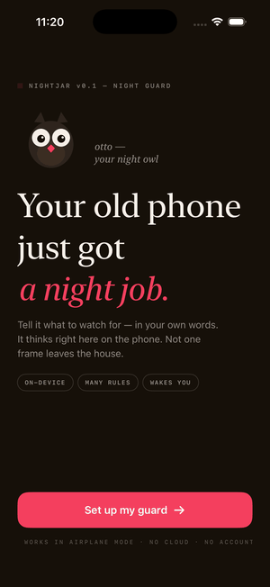
  &nbsp;&nbsp;
  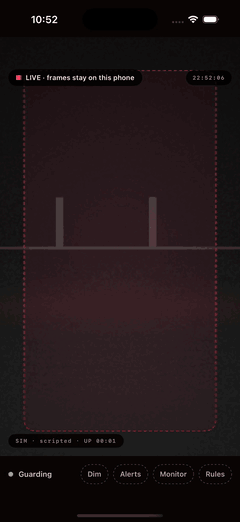
</p>
<p align="center"><sub>Left, the setup flow: describe a rule in English, confirm it, mark a zone, guard. Right, the live guard on a Mac webcam / iOS: the gate tracks motion and the alert fires.</sub></p>

## Try it (judges start here)

Five minutes, no iPhone and no model needed. Only a C++17 compiler and CMake.

```sh
git clone https://github.com/hungtruongOwolf/nightjar && cd nightjar
make test    # 23/23 unit tests: NEON==scalar parity, temporal engine, clip codec
make demo    # full pipeline on a synthetic clip, prints alerts + a self-generated report
make bench   # gate micro-benchmark: per-step scalar vs NEON, us/frame
```

- Live camera demo on a Mac webcam: `cd shells/ios && xcodegen && xcodebuild -scheme NightjarMac -configuration Release build`, then open the built `NightjarMac.app` and allow the camera.
- Real SmolVLM path and the full 5-tier validation ladder: [JUDGES.md](JUDGES.md).
- Sample `make demo` output: [report.md](report.md). What's done plus submission notes: [SUBMISSION.md](SUBMISSION.md).

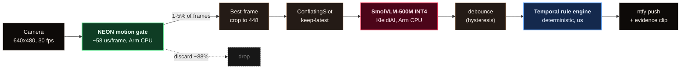
<sub>Green is the cheap Arm-CPU gate that runs on every frame. Rose is the expensive VLM (KleidiAI, CPU) that only sees the 1-5% of frames that pass. Blue is the deterministic microsecond reasoning. About 88% of frames never reach the VLM.</sub>

---

## Why this exists: the last mile of AI is a sentence

Arm has shipped roughly 300 billion chips. The smartest ones are in a drawer near you. That old phone is a camera, a neural engine, a battery and a radio, a supercomputer from a few years ago, switched off and waiting for landfill. Meanwhile, teaching a camera to notice the one thing you actually care about still takes an ML team, a labelled dataset, and a cloud GPU that quietly streams your living room to someone else's servers.

Nightjar collapses all of that into one plain-English sentence, on hardware you already own, that never phones home.

> ### The spreadsheet moment for computer vision
> VisiCalc didn't turn people into programmers. It let anyone express logic and had the machine run it, and a whole economy fell out of that. Nightjar doesn't turn you into an ML engineer. You describe what matters, and a forgotten phone watches for it, on-device, for as long as you leave it plugged in, for free. The people who can use this aren't developers. They're anyone with a camera and a worry.

| Pillar | The bet |
|---|---|
| **Perception becomes a sentence** | From "hire an ML team and rent a GPU" to "type what matters." The barrier to programming a camera drops to zero. |
| **Resurrect a billion idle devices** | The greenest, cheapest AI accelerator on Earth is the one already in your drawer. Nightjar gives e-waste eyes and a job, with no new silicon and no data centre. |
| **Flip the surveillance model** | Today the camera works for the cloud. Nightjar makes it work for you. Pixels never leave the device, there's no account and no subscription, and it's offline by default. Privacy here isn't a setting, it's the architecture. |
| **One engine, many jobs** | *"if grandma hasn't moved in 2 hours"*, *"if the baby climbs out of the crib"*, *"when the delivery arrives"*, *"if the stove was left on."* Security is just the first sentence. Elder-care, child-safety, accessibility, wildlife, retail: same engine, new sentence. |

The endgame is a private, programmable eye on every idle screen. And the pattern underneath, a small model used as a per-frame sensor with deterministic code as the brain, is a reusable way to build on-device AI. This repo is the working proof, running today on Arm.

---

## What it does that a motion camera can't: time

A single frame can't tell you a behavior. Nightjar reasons over the trajectory of what the VLM sees, so it fires on conditions a closed-vocabulary detector cannot even express.

| Condition | How it's decided (over time) |
|---|---|
| **Loitering** | `person` present continuously for >= N seconds |
| **Package left (delivery)** | an object appears and stays while the person leaves |
| **Package taken (theft)** | an object was there and disappears while a person is around |
| **Appears** | rising edge, so it isn't spammed every frame |

Placing an object and taking one look identical in a single frame. Nightjar tells them apart by the object's presence before versus after, never from one image:

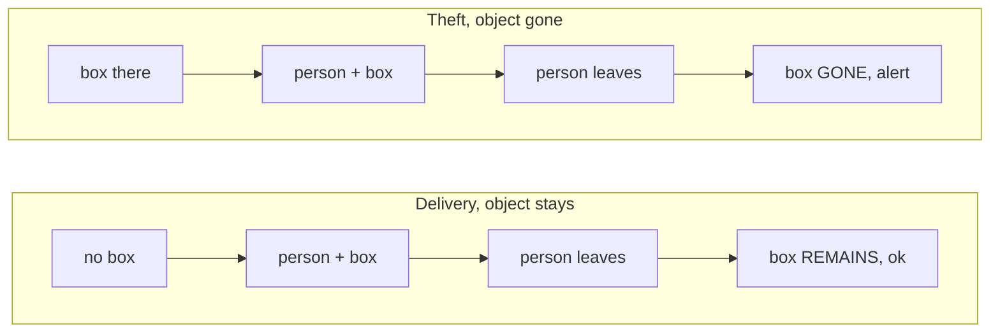

The VLM never judges *"is this theft?"*. It only answers simple per-frame facts (*"is there a box? a person?"*), debounced against sensor noise. All the reasoning is deterministic microsecond code, not a per-frame model call.

---

## Architecture: perception vs reasoning

The core idea, and the reason it runs on a phone at all, is decoupling the expensive, noisy part (vision) from the cheap, exact part (decisions).

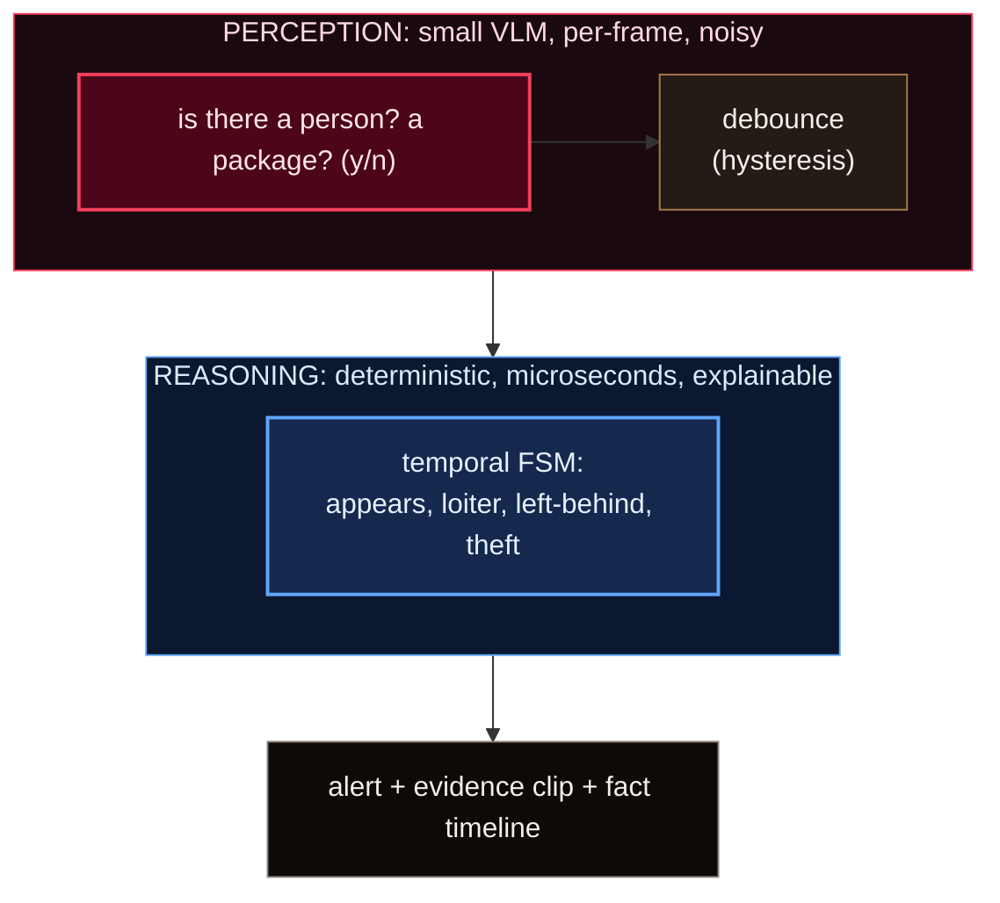

It's one portable C++ engine with two thin shells (iOS SwiftUI and a macOS replay/webcam app). The gate runs on a `.utility` QoS queue (E-cores), the VLM on `.userInitiated` (P-cores), and a `ConflatingSlot` decouples them so the fast path never blocks on the slow one.

---

## From English to a running rule (compiled once, at setup)

We measured that a small model can't reliably emit a whole nested rule in one shot (about 2/8). So we decompose the problem: it only ever answers focused classification questions, which it does reliably, and deterministic code assembles the rule.

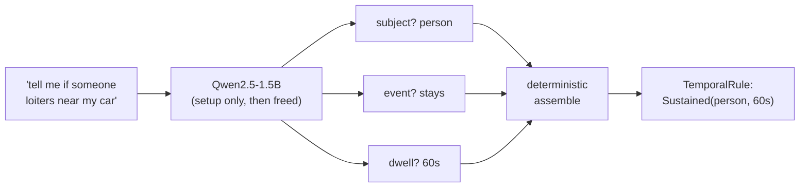

| Compiler | Subject | Trigger |
|---|---|---|
| Nested one-shot AST (1.5B and 3B) | | **~2/8** |
| **Decomposed + few-shot (1.5B)** | **12/12** | **12/12** |
| SmolVLM text backbone (baseline) | 12/20, then escalates to Qwen | |

The confirmation screen is a first-class safety net. A small model can be wrong, so the user is never misled.

---

## Measured on Arm  `[VERIFIED: M2 Max, SmolVLM-500M-Q4_0]`

Every optimization is a real number, not a claim. iPhone A15 figures are pending a data cable and marked TBD.

| Optimization | Lever | Result |
|---|---|---|
| Two-tier motion gate | run the VLM on 1-5% of frames | **88% of VLM compute avoided** |
| NEON Tier-1 gate | hand-written, scalar-twin tested | **58 us/frame** (budget 500 us) |
| KV-cache reuse (encode-once) | image encoded once per event | VLM **586 to 229 ms, 2.6x**, answers identical |
| Fast-path decoupling | letterbox off the capture thread | gate p99 **4 ms to 73 us, 54x** under burst |
| INT4 clip storage | JPEG keyframe | **11.7x** vs raw |
| Inter-frame delta storage | reuse the gate's block model | **2.5x** more (unbounded on static), lossless |

End-to-end (real SmolVLM, encoder on Metal, LLM on CPU): VLM `p50 149 ms`, event to alert `p50 174 ms / p99 666 ms`. ISA: `FEAT_DotProd=1, FEAT_I8MM=1, FEAT_SME=0`.

The Tier-1 gate compiles to real NEON: `uabd.16b` (abs-diff), `ushll/ushl.4s` (fixed-point EMA), `uaddw.8h` (block counts), 294 vector-lane ops in a single object, with a scalar twin and a parity test. Disassembly and the intrinsic-to-instruction map are in [`docs/neon-isa.md`](docs/neon-isa.md).

The portable engine builds and passes its full test suite on three Arm platforms from one source: macOS (M2 Max), Linux aarch64 (`Dockerfile.linux-arm64`), and iPhone (Simulator-verified today, A15 pending a cable). On Linux aarch64 the KleidiAI INT4 kernels give +7.2% prefill, which is the image-token regime that dominates VLM latency. It's measured on/off, with an honest reading in [`bench/kleidiai_results.md`](bench/kleidiai_results.md).

The six mobile constraints the track names:

| model size | memory | responsiveness | battery | offline | TTFT |
|---|---|---|---|---|---|
| 244 MB (Q4_0) + 190 MB mmproj | <= 1.4 GB budget | 149 ms VLM | 88% compute gated | airplane mode | encode 32 ms |

---

## Storage: we don't store video, we store events

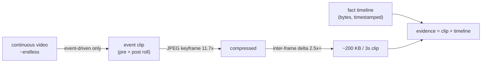

A bounded, rotating on-device store, with a hard cap and the oldest clip evicted first. A clip is a span of frames (real evidence), never a single image. On iOS the same encoder seam takes the hardware HEVC encoder, at near-zero energy.

---

## The app

Two thin shells over one portable C++ engine, with 0% business logic in Swift, reached through an Obj-C++ bridge. You type a rule in plain English; it's compiled once, on-device, into a structured rule (the confirmation screen is the safety net); then the guard runs live. Frames stream through the whole pipeline in real time, the same path AVFoundation feeds, so you watch the motion gate track a figure and the alert fire the moment the temporal rule trips.

The flow is hello, type a rule, confirm, mark the zone, watch list, live guard.

<p align="center">
  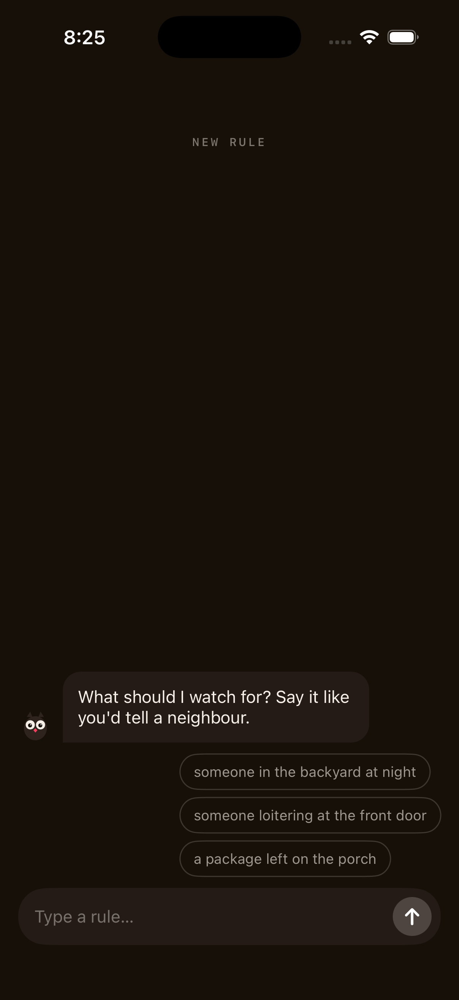
  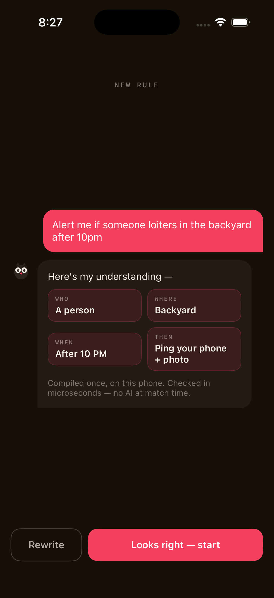
  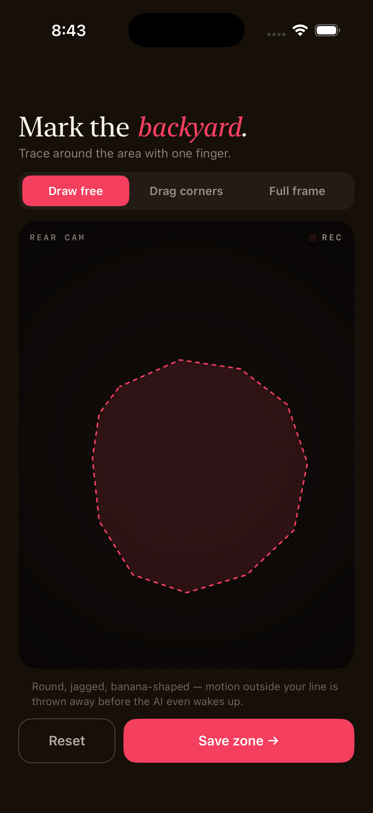
  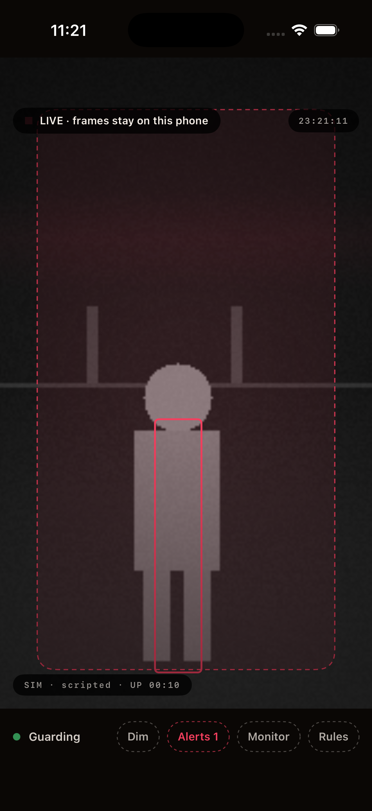
  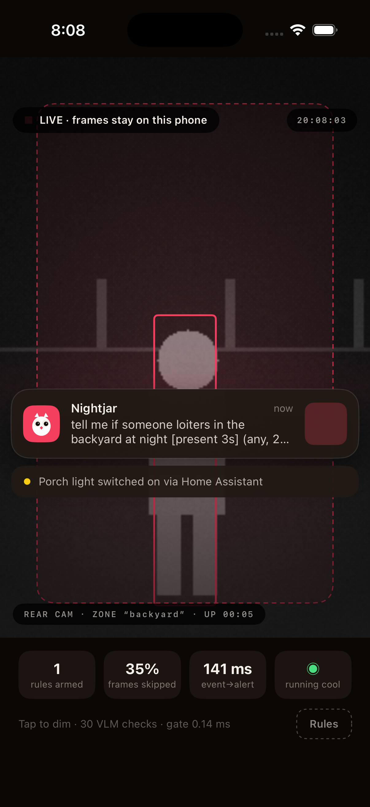
</p>

- **Real camera.** A macOS target (`NightjarMac`) runs the live guard on the Mac webcam, so you can test it with no cable. iOS takes the device camera; the Simulator has no camera and falls back to a synthetic scene, labelled `SIM`.
- **Rule input to compile.** English becomes `WHO / WHERE / WHEN / THEN`, on-device. (The app build uses a deterministic closed-vocab parser; the LLM-backed `DecomposedRuleCompiler` in the engine is the production path.)
- **Draw the zone.** Freehand, drag-corners, or full-frame. The shape is rasterized to the gate's block grid, so motion outside the line is discarded before the VLM ever wakes (`Pipeline::set_zone_mask`).
- **Numbers live in a separate Monitor**, not the guard, so the app stays focused on watching and alerting. The benchmark source of truth is the offline replay harness (`make demo`, `report.md`).

---

## When not to use Nightjar

This is not a life-safety system. A small VLM has false negatives, and we publish them. There is no face recognition and no "known vs. stranger." No video leaves the device except the alert crop you configure. Degraded modes (thermal `.critical`, VLM failure) announce themselves honestly as *"motion-only."*

## Reusable artifacts

A portable C++ engine, a replay and energy harness, the NEON gate with scalar twins, the decomposed natural-language-to-rule compiler with its few-shot prompt assets, the inter-frame clip codec, and a reproducible compiler eval.

## License

MIT, see [LICENSE](LICENSE).
